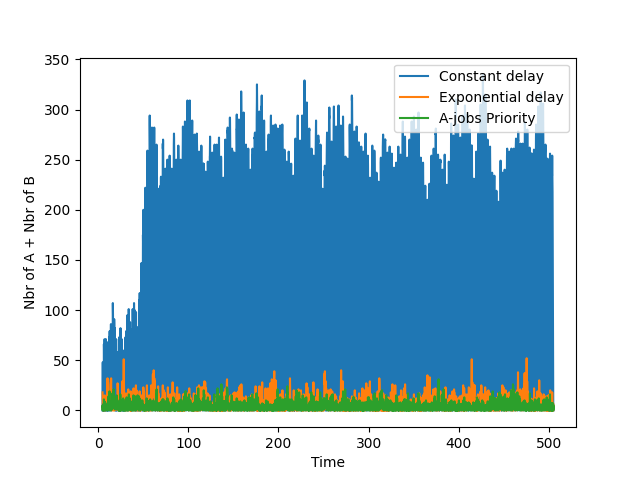

## Task 2

1. 130.6.

2. 6.4

3. 4.8

4.

- In the first scenario, when a queue of A-jobs forms, we know for certain that in 1 second the same exact queue will form but with B-jobs instead. Since they take 0.02s longer, it's inevitably that there will be delay.

- In the second scenario, the delay distribution is exponential instead of constant, which means the risk for delay because of new B-jobs is lesser. Compare this to the first scanrio where it is certain.

- In the third scenario we let A-jobs have higher priority but still have a constant delay distribution. But by letting A-jobs be served first we can lower the delay by serving the jobs which takes the least time, that is the A-jobs.

